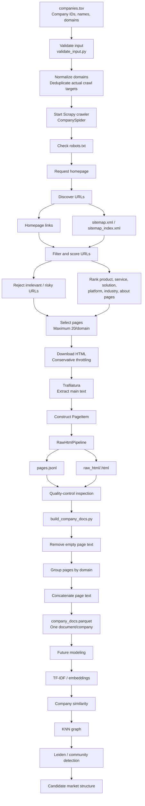
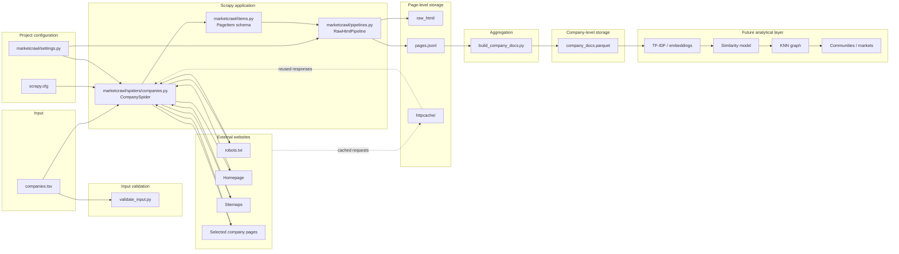

See Dropbox for files.
# Intro

A conservative pilot crawler for company websites.

# Files
https://www.dropbox.com/scl/fo/2ceyu9lqrm44lq158ndbl/ACU6Y9uT_PkrI_1wuuSkTgc?rlkey=vcj2xmdd0laqob0902hqewymb&st=zjew59cr&dl=0

Table 1 - File inventory

| File                             | Type                       | What it does                                                                                                                                                                                                                                                                   | Function in the project                                                                                         | Why we need it                                                                                                                                                                        |
| -------------------------------- | -------------------------- | ------------------------------------------------------------------------------------------------------------------------------------------------------------------------------------------------------------------------------------------------------------------------------ | --------------------------------------------------------------------------------------------------------------- | ------------------------------------------------------------------------------------------------------------------------------------------------------------------------------------- |
| README.md                        | Documentation              | Explains installation, configuration, crawl execution, aggregation, quality-control checks, and the project’s conservative crawling policy.                                                                                                                                  | Human-facing instructions for operating the project.                                                            | Makes the project reproducible and prevents us from having to remember commands and assumptions manually.                                                                             |
| scrapy.cfg                       | Scrapy configuration       | Tells Scrapy that the project’s settings module is marketcrawl.settings and identifies the Scrapy project as marketcrawl.                                                                                                                                                    | Entry-point configuration used when commands such as scrapy crawl companies are run from the project directory. | Without it, Scrapy would not automatically know which project/settings to load.                                                                                                       |
| companies.tsv                    | Input data                 | Contains company_id, company_name, and domain for the 20 pilot accounts.                                                                                                                                                                                                       | Defines the set of companies whose websites will be crawled.                                                    | This is the initial sampling frame. The crawler cannot know what companies to examine without an input universe.                                                                      |
| validate_input.py                | Utility script             | Reads companies.tsv, normalizes domains, and identifies duplicate domains.                                                                                                                                                                                                     | Quality-control step before crawling.                                                                           | Prevents accidental duplicate crawling and exposes problems in the input data. In the current data it identifies the duplicate myparticipants.com records.                            |
| build_company_docs.py            | Data-processing script     | Reads page-level records from pages.jsonl, removes records with empty extracted text, groups pages by domain, concatenates their text, and writes one company-level record per domain to Parquet.                                                                              | Converts the crawler’s page-level corpus into the company-level corpus needed for market modeling.            | Your similarity model ultimately needs a representation of each company, rather than separate representations of every webpage.                                                       |
| marketcrawl/__init__.py          | Python package marker      | Marks the marketcrawl directory as a Python package. It contains no executable code.                                                                                                                                                                                           | Allows Python/Scrapy to import modules such as marketcrawl.settings, marketcrawl.items, etc.                    | Mostly structural. It makes the project directory behave reliably as an importable Python package.                                                                                    |
| marketcrawl/settings.py          | Scrapy configuration       | Defines crawler identity, robots.txt compliance, request concurrency, delays, AutoThrottle, retry rules, HTTP caching, depth limits, encoding, logging, and the item pipeline.                                                                                                 | Controls how the crawler behaves toward websites.                                                               | This is the principal protection against excessive crawling and accidental server overload. It also makes crawl behavior explicit and reproducible.                                   |
| marketcrawl/items.py             | Data-schema definition     | Defines the fields associated with each crawled webpage: company IDs/names, domain, URL, page type, timestamp, HTTP status, title, clean text, word count, and content hash.                                                                                                   | Establishes the structure of a page-level observation.                                                          | Gives the crawler a consistent data schema rather than producing arbitrary dictionaries with potentially inconsistent fields.                                                         |
| marketcrawl/pipelines.py         | Scrapy processing pipeline | Receives each extracted PageItem, takes the hidden raw HTML attached to it, computes its SHA-256 hash, stores the HTML in raw_html/, and removes the raw bytes from the exported record.                                                                                       | Separates large raw webpage files from the compact structured dataset.                                          | Preserves the original evidence so text extraction can later be changed or audited without revisiting the website. Hash-based filenames also avoid storing identical HTML repeatedly. |
| marketcrawl/spiders/__init__.py  | Python package marker      | Marks marketcrawl/spiders/ as a Python package. It contains no executable code.                                                                                                                                                                                                | Allows Scrapy/Python to recognize and import spider modules in the directory.                                   | Structural requirement/convention for keeping crawler definitions organized.                                                                                                          |
| marketcrawl/spiders/companies.py | Main crawler               | Reads the company list, normalizes and deduplicates domains, requests homepages and sitemaps, discovers candidate pages, scores URLs, filters undesirable URLs, downloads selected pages, extracts text with Trafilatura, classifies page types, and creates PageItem records. | This is the central program implementing the actual web-crawling and page-selection logic.                      | Nearly all substantive data collection happens here. It determines which websites are crawled, which webpages count as relevant evidence, and what text enters the corpus.            |
Table 2 - How to think about the files

| Layer                     | Files                                                    |
| ------------------------- | -------------------------------------------------------- |
| Project instructions      | README.md                                                |
| Input                     | companies.tsv                                            |
| Input validation          | validate_input.py                                        |
| Scrapy bootstrap          | scrapy.cfg                                               |
| Crawl behavior            | marketcrawl/settings.py                                  |
| Crawl logic               | marketcrawl/spiders/companies.py                         |
| Page schema               | marketcrawl/items.py                                     |
| Raw-data preservation     | marketcrawl/pipelines.py                                 |
| Company-level aggregation | build_company_docs.py                                    |
| Python package structure  | marketcrawl/__init__.py, marketcrawl/spiders/__init__.py |
Table 3 - Artifacts

| Artifact                                  | Created when                                             | Created/modified by              | Contents                                                                                                                           | Role in process                                                                        | Persistent?                                                                     |
| ----------------------------------------- | -------------------------------------------------------- | -------------------------------- | ---------------------------------------------------------------------------------------------------------------------------------- | -------------------------------------------------------------------------------------- | ------------------------------------------------------------------------------- |
| companies.tsv                             | Before the crawl                                         | You / source-data preparation    | One row per supplied account with company_id, company_name, and domain.                                                            | Initial company sampling frame.                                                        | Yes; source input.                                                              |
| Normalized domain representation          | When validate_input.py or the spider reads companies.tsv | validate_input.py / companies.py | Domains stripped of scheme and www, e.g. http://www.respondent.io → respondent.io.                                               | Establishes a common identifier for domains and reveals duplicate source records.      | In validation it is temporary/displayed; inside the spider it exists in memory. |
| company_by_domain                         | Spider initialization                                    | companies.py                     | Mapping from normalized domain to one or more original company rows.                                                               | Deduplicates web requests while preserving source IDs.                                 | No; in-memory only.                                                             |
| Initial homepage request                  | Beginning of crawl                                       | companies.py                     | HTTPS request such as https://respondent.io/.                                                                                      | Establishes contact with each domain and discovers initial content.                    | No.                                                                             |
| robots.txt response                       | During crawling                                          | Scrapy RobotsTxtMiddleware       | Site-specific crawler permissions.                                                                                                 | Determines whether requested pages may be crawled under the site’s robots policy.    | Normally handled internally; may also enter HTTP cache.                         |
| Homepage HTML                             | During crawling                                          | Web server → Scrapy            | Raw HTML returned from the company’s homepage.                                                                                   | Source evidence and source of additional internal links.                               | Yes, after pipeline processing in raw_html/.                                    |
| sitemap.xml / sitemap_index.xml responses | After homepage retrieval                                 | companies.py                     | Site-published lists of URLs and possibly child sitemap files.                                                                     | Provides efficient URL discovery without blindly recursively crawling every hyperlink. | Responses may be cached; they are not exported as company observations.         |
| Candidate URL set                         | During homepage/sitemap parsing                          | companies.py                     | Internal URLs that may contain useful company information.                                                                         | Pool from which research-relevant pages are selected.                                  | No; in-memory only.                                                             |
| URL score                                 | During candidate selection                               | page_score() in companies.py     | Numerical relevance score based on path terms such as product, services, blog, careers, etc.                                       | Prioritizes commercial/product information over irrelevant website content.            | No; currently not stored.                                                       |
| Selected URL set                          | During crawl                                             | schedule_candidates()            | Up to the permitted number of candidate pages for each domain.                                                                     | Determines which pages are actually requested.                                         | In memory while crawling; URLs later appear in pages.jsonl.                     |
| HTTP response                             | Every downloaded page                                    | Web server → Scrapy            | Status code, headers and body/HTML.                                                                                                | Raw observation from the company website.                                              | HTML is archived; structured information becomes a PageItem.                    |
| Clean extracted text                      | Immediately after downloading a selected page            | Trafilatura inside make_item()   | Main textual content after removing much webpage boilerplate.                                                                      | Textual measurement used later to characterize the company.                            | Stored in pages.jsonl.                                                          |
| PageItem                                  | During page processing                                   | companies.py                     | Structured page-level observation containing metadata and extracted text.                                                          | Standard internal representation passed through Scrapy’s processing pipeline.        | Temporary object; its fields are subsequently exported.                         |
| raw_html/                                 | First time the spider runs and emits an item             | RawHtmlPipeline                  | Individual .html files named by SHA-256 content hash.                                                                              | Archival copy of original website evidence.                                            | Yes.                                                                            |
| raw_html/<SHA256>.html                    | For every unique HTML response                           | RawHtmlPipeline                  | Exact raw response body of a crawled page.                                                                                         | Enables auditing or future re-extraction without another web request.                  | Yes.                                                                            |
| content_hash                              | During page processing                                   | companies.py / RawHtmlPipeline   | SHA-256 digest of page HTML.                                                                                                       | Identifies page content and provides a deduplication/audit key.                        | Stored in pages.jsonl; used as raw-HTML filename.                               |
| pages.jsonl                               | When running scrapy crawl companies -O pages.jsonl       | Scrapy feed exporter             | One JSON record per successfully processed page.                                                                                   | Principal page-level dataset produced by crawling.                                     | Yes.                                                                            |
| httpcache/                                | During crawling if caching is enabled                    | Scrapy HTTP cache                | Cached HTTP responses from recent requests.                                                                                        | Prevents repeated development runs from unnecessarily re-requesting the same pages.    | Yes until deleted/expired.                                                      |
| Scrapy logs                               | During crawl                                             | Scrapy                           | Request status, errors, retries, crawl statistics, warnings, etc.                                                                  | Operational diagnostics, especially for 403s, timeouts, malformed websites, etc.       | Usually console output unless redirected to a file.                             |
| In-memory page DataFrame                  | When running build_company_docs.py                       | pandas                           | Parsed contents of pages.jsonl.                                                                                                    | Intermediate representation used for aggregation.                                      | No.                                                                             |
| Company-level document                    | During aggregation                                       | build_company_docs.py            | Concatenation of all nonempty selected page texts belonging to a domain.                                                           | Defines the text corpus observation D_i for company i.                                 | Stored in company_docs.parquet.                                                 |
| company_docs.parquet                      | After running build_company_docs.py                      | pandas/PyArrow                   | One row per normalized domain containing IDs, names, URLs, page types, concatenated document, word count and last crawl timestamp. | Principal company-level modeling dataset.                                              | Yes.                                                                            |
| TF-IDF matrix                             | Future modeling stage; not currently produced by the ZIP | Future analysis code             | Companies × textual features/terms.                                                                                               | Numerical representation used for similarity calculations.                             | Not yet implemented.                                                            |
| Similarity matrix                         | Future modeling stage                                    | Future analysis code             | Pairwise company similarities.                                                                                                     | Basis for nearest-neighbor and graph construction.                                     | Not yet implemented.                                                            |
| KNN graph                                 | Future modeling stage                                    | Future analysis code             | Company nodes connected to their nearest neighbors.                                                                                | Network representation of local market similarity.                                     | Not yet implemented.                                                            |
| Community assignments                     | Future modeling stage                                    | Leiden/Louvain/etc.              | Company → inferred community/market.                                                                                             | Final market-discovery output.                                                         | Not yet implemented.                                                            |
# Diagrams
Overall workflow


Architecture


# Procedure
## Step 1 - Create the environment

```bash
conda create -n marketcrawl python=3.12 -y
conda activate marketcrawl
pip install scrapy trafilatura pandas pyarrow lxml
```

## Step 2 - Identify the crawler

Open:

`marketcrawl/settings.py`

Replace:

`REPLACE_WITH_YOUR_EMAIL`

with an email address you are willing to expose in the crawler User-Agent. E.g., a Firefox Relay mask.

## Step 3 - Review the input

`companies.tsv` contains the 20 companies supplied for the pilot.

MyParticipants appears twice (company IDs 5 and 7). The spider normalizes the
domain and crawls it once, while retaining both IDs/names in the output.

It is OK to upload a different TSV list with unique records and run the program as-is.

## Step 4 - Run the crawl

From this project directory:

```bash
scrapy crawl companies -O pages.jsonl
```

The crawler will:
- obey robots.txt;
- make at most one simultaneous request to a given domain;
- impose a 2-second base download delay;
- use Scrapy AutoThrottle;
- prefer HTTPS;
- try sitemap.xml and sitemap_index.xml;
- score URLs for product/service/solution relevance;
- cap selected content pages at 20 per normalized domain;
- avoid query-string URLs and common crawl traps;
- save raw HTML once by SHA-256 hash in `raw_html/`;
- extract main text with Trafilatura;
- save structured page data to `pages.jsonl`.

## Step 5 - Inspect before scaling

Do **not** immediately jump from 20 companies to thousands.

Check:
- number of pages captured per domain;
- whether pages are actually product/service/about pages;
- whether extracted text is meaningful;
- which domains return 403/429;
- which domains are mostly JavaScript shells;
- whether sitemap discovery is excessive or poor.

## Step 6 - Convert page data into company documents

The included `build_company_docs.py` aggregates page-level records into one
document per normalized domain.

```bash
python build_company_docs.py pages.jsonl company_docs.parquet
```

The Parquet file can then feed TF-IDF, embeddings, cosine similarity, KNN,
and community-detection experiments.

## Note: IP-ban / server-load policy

This project is intentionally conservative. It does not rotate IP addresses,
spoof browser identities, bypass CAPTCHAs, or retry 403/429 responses.

A 403 or 429 should be treated as a signal to stop or reduce access to that
site rather than an obstacle to defeat.
